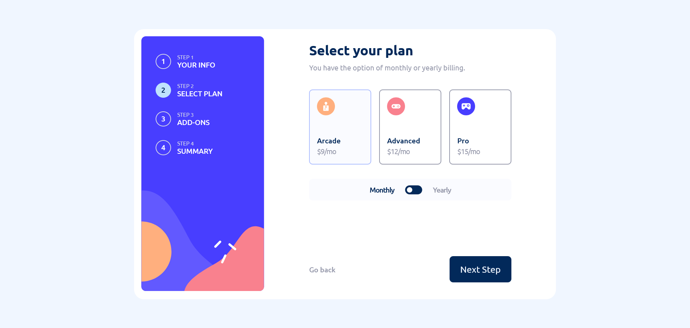
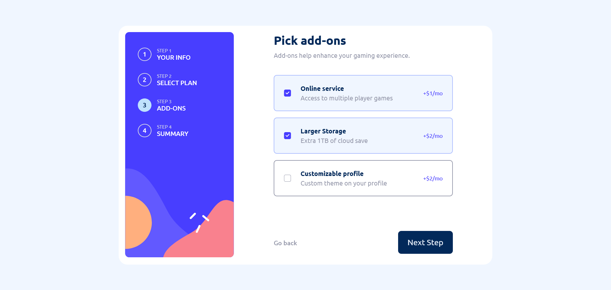
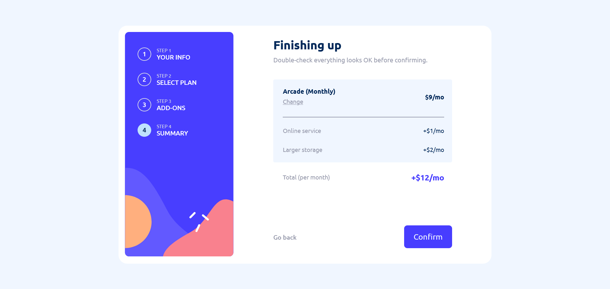
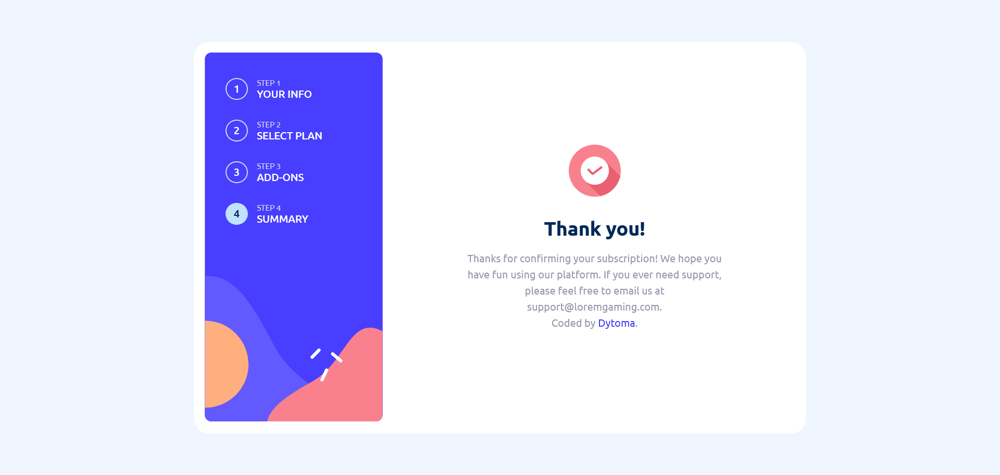

# Frontend Mentor - Multi-step form solution

This is a solution to the [Multi-step form challenge on Frontend Mentor](https://www.frontendmentor.io/challenges/multistep-form-YVAnSdqQBJ). Frontend Mentor challenges help you improve your coding skills by building realistic projects. 

## Table of contents

- [Overview](#overview)
  - [The challenge](#the-challenge)
  - [Screenshot](#screenshot)
  - [Links](#links)
  - [Built with](#built-with)
  - [What I learned](#what-i-learned)
  - [Continued development](#continued-development)
- [Author](#author)

**Note: Delete this note and update the table of contents based on what sections you keep.**

## Overview

  For this solution, I used react, react router and tailwind css. It was fun building it although it took me a lot of time. I definitely liked React and probably gonna use it from now on.

### The challenge

Users should be able to:

- Complete each step of the sequence
- See a summary of their selections on the final step and confirm their order
- View the optimal layout for the interface depending on their device's screen size
- See hover and focus states for all interactive elements on the page

### Screenshot

These are some screenshots of my solution. 

### Links

- Solution URL: [Add solution URL here](https://github.com/Dytoma/multi-step-form)
- Live Site URL: [Add live site URL here](https://admirable-conkies-b34b97.netlify.app/)

### Built with

- Semantic HTML5 markup
- CSS custom properties
- Flexbox
- CSS Grid
- Mobile-first workflow
- [React](https://reactjs.org/) - JS library
- [React Router](https://reactrouter.com/en/main) - React framework
- [Tailwind CSS](https://tailwindcss.com/) - For styles

### What I learned

I was just starting learning react and I used it to complete this project. At first it was confusing and a bit difficult but after some practice I gained some knowledge and used it for this project. I did not focus on best practices of react, my main purpose was to complete this challenge and I'm actually glad I did it.

### Continued development

For my next project I will focus on best practices in react and start learning Redux, MUI or styled components in order to master this library.

## Author

- Frontend Mentor - [@Dytoma](https://www.frontendmentor.io/profile/Dytoma)
- Twitter - [@OmarDytoma](https://www.twitter.com/OmarDytoma)
